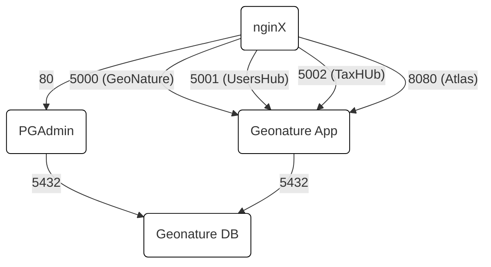

# GeoNature-docker

Utilisation de Docker pour le déploiement de GeoNature dans le cadre d'un hébergement mutualisé (plusieurs instances GeoNature hébergées par sur un serveur commun).

## Contributeurs

Ce _portage_ de GeoNature sous Docker a été réalisé par le [BRGM](https://www.brgm.fr) dans le cadre de la convention BRGM/OFB.

## Projets liés

### Applications

* [PnX-SI](https://github.com/PnX-SI) / [UsersHub](https://github.com/PnX-SI/UsersHub)
* [PnX-SI](https://github.com/PnX-SI) / [TaxHub](https://github.com/PnX-SI/TaxHub)
* [PnX-SI](https://github.com/PnX-SI) / [GeoNature](https://github.com/PnX-SI/GeoNature)
* [PnX-SI](https://github.com/PnX-SI) / [GeoNature-atlas](https://github.com/PnX-SI/GeoNature-atlas)

### Modules geonature

* [PnX-SI](https://github.com/PnX-SI) / [Import](https://github.com/PnX-SI/gn_module_import)
* [PnX-SI](https://github.com/PnX-SI) / [Export](https://github.com/PnX-SI/gn_module_export)
* [PnX-SI](https://github.com/PnX-SI) / [Export](https://github.com/PnX-SI/gn_module_monitoring)

### Sous-modules de suivi (gn_module_monitoring)

Une ribambelles de sous-modules de suivi
* [PnCevennes](https://github.com/PnCevennes) / [Export](https://github.com/PnCevennes/protocoles_suivi)

### Autres composants

* [kartoza](https://github.com/kartoza) / [docker-postgis](https://github.com/kartoza/docker-postgis) : Base de données PostgreSQL + PostGIS
* [pgAdmin](https://hub.docker.com/r/dpage/pgadmin4/) : Application d'interfaçage avec la base de données
* [nginX](https://hub.docker.com/_/nginx/) : Reverse Proxy

## Architecture



## Installation

### Prérequis/Informations initiales

#### Dépendances

Ce projet nécessite l'installation préalable de:
* [docker](https://docs.docker.com/engine/install/)
* [git](https://git-scm.com/download/linux)
* [docker-compose](https://docs.docker.com/compose/install/)

_Dans notre exemple nous utiliserons un certain nombre d'assertions._

* Le répertoire `/applications` est la base de notre environnement de travail.
* Le répertoire `/applications/projets` contiendra les différents instances de GeoNature.
* Le répertoire `/applications/geonature` contiendra le contenu du dépôt git de _GeoNature_.
* Le répertoire `/applications/administration` contiendra les différents outils d'administration.

#### Dépôt geonature

* Dans le dépôt git, la branche à utiliser est `git-maj`.
* Dans le dépôt git, les sources sont dans le répertoire racine (celui où est situé ce `README.md`).

### Etapes d'installation

#### Cloner le dépôt _GeoNature-docker_ sur la machine


```bash
mkdir -p /applications

cd /applications

git clone https://github.com/PnX-SI/GeoNature-docker.git geonature

### Actuellement le bon contenu est dans la branche "main", il faut donc se mettre dessus (si vous venez de checkout, ce sera le cas directement).
cd geonature
git checkout git-maj
```

#### Construire l'image GeoNature (facutatif)

_Cette étape est facultative si l'image peut-être récupérée d'un registre Docker ou bien si le CI/CD du projet est mis en place._

```bash
### Dans le répertoire _app__, il faut adapter le nom du tag
docker build --force-rm -t geonature:git-maj app/
```

#### Créer un répertoire pour le GeoNature que l'on veut déployer, par exemple en spécifiant votre domaine (remplacer `<mondomaine.org>` par le nom de votre choix).

```bash
mkdir -p /applications/projets/<mondomaine.org>
```

#### Copier l'environnement

```bash
cp /applications/geonature/env.sample /applications/projets/<mondomaine.org>/.env
cp /applications/geonature/docker-compose.yaml /applications/projets/<mondomaine.org>/
```

#### Editer l'environnement

```bash
vim /applications/projets/<mondomaine.org>/.env
```

_Exemple de configuration (dans cet exemple, une image déjà présente est utilisé, si vous avez construit l'image docker par vous même, indiquez ici son tag):_

```properties
POSTGRES_DB=geonature
POSTGRES_USER=geonature
POSTGRES_PASS=geonature
PGDATA_DIR=/home/admin_pnc/info/GeoNature-docker/projets/test/pgdata
BOOTSTRAP_DIR=/home/admin_pnc/info/GeoNature-docker/bootstrap_files
GEONATURE_COMMON_DIR=/home/admin_pnc/info/GeoNature-docker/projets/test/geonature_common
GEONATURE_DOMAIN=127.0.0.1  
GEONATURE_PROTOCOL=http
GEONATURE_VERSION=2.6.2
GEONATURE_DOCKER_VERSION=git-maj
RESET_ALL=false
DEBUG=false
SRID_LOCAL=2154 
GEONATURE_IMAGE=geonature:git-maj
NGINX_CONF=/home/admin_pnc/info/GeoNature-docker/nginx.conf
HTTP_PROXY=
PGADMIN_DEFAULT_EMAIL=a
PGADMIN_DEFAULT_PASSWORD=a
APPLICATIONS=geonature-2.6.2 usershub-2.1.3 taxhub-1.7.3 atlas-1.4.2
MODULES_GEONATURE=import-1.1.2 export-1.2.4 monitoring-0.2.2
MODULES_MONITORING=cheveches-master oedic-master
```

#### Créer le réseau permettant de gérer le _reverse proxy_

```bash
docker network create rpx_net
```

#### Copier le répertoire _nginx-proxy_ où on veut gérer le proxy

```bash
mkdir -p /applications/administration

cp -r nginx-proxy /applications/administration/nginx-proxy

```

#### Installer le service nginx-proxy

_Vous pouvez aussi aller lire la documentation dans le répertoire nginx-proxy._

```bash
cp /applications/administration/nginx-proxy/nginx-proxy.service /etc/systemd/system
systemctl daemon-reload
systemctl enable nginx-proxy --now
```

#### Installer le service geonature

```bash
### Copie de l'Unit
cp /applications/geonature/geonature.service /etc/systemd/system/

### Edition de l'Unit (au moins deux parties à modifier ##Geonature##)
vim /etc/systemd/system/geonature.service

### Activation du service
systemctl daemon-reload
systemctl enable geonature --now
```

## Mise à jour de la configuration

### Installer un module

- On peut au choix renseigner la ligne MODULES_GEONATURE du fichier .env et relancer docker-compose, 
- ou bien renseigner la manipulation suivante pour une installation manuelle.


L'installation des modules se fait indépendamment dans chacune des instance. Il faut pour cela se connecter terminal du conteneur. Suivez ensuite la démarche habituelle d'installation du module. Ici un exemple avec le module [gn_module_dashboard](https://github.com/PnX-SI/gn_module_dashboard).

```bash
docker ps
# On récupère le nom ou le hash du container de geonature pour lancer un exec dessus
docker exec -it <id ou nom de mon conteneur geonature> /bin/bash

mkdir -p /geonature/gn_modules
cd /geonature/gn_modules

# Téléchargement, décompression et configuration du module
wget https://github.com/PnX-SI/gn_module_dashboard/archive/0.2.0.zip 
unzip 0.2.0.zip
mv gn_module_dashboard_0.2.0 gn_module_dashboard

# Finalisation de l'installation du module
# On initialize l'environnement virtuel python de GeoNature
source /geonature/geonature/backend/venv/bin/activate
# On installe le module GeoNature avec la commande : geonature install_gn_module <chemin absolu vers mon module> <url relative du module>
geonature install_gn_module /geonature/gn_modules/gn_module_dashboard dashboard

```

### Changement d'URL de l'application

Si vous avez besoin de changer l'URL de l'application (changement de DNS, ou bien passage de http à https), il ne suffit pas de modifier le `.env` pour que celà fonctionne. En effet, les fichiers de configuration de l'application étant transformés pour le front et dans une moindre mesure pour la partie Python, il faut aussi modifier ces fichiers là.

#### Dans tous les cas

Modifiez le `.env` pour mettre à jour l'URL et le protocole. Ce fichier est quand même réutilisé pour créer les `settings.ini` des différentes applications.

#### Configuration Application

Changer les fichiers présents dans le dossier bootstrap
- `atlas.settings.py`
- `geonature.settings.py`
- `usershub.settings.py`
- `taxhub.settings.py`
-
- `geonature_config.toml`
- `atlas.config.py`
- `usershub.config.py`
- `taxhub.config.py`

A noter que certains champs sont déduit automatiquement ce qui est renseigné dans les fichiers settings.ini (qui peuvent dépendre du fichier .env en particulier pour les paramètres suivants), par exemple

- les paramètres de route
 - `URL_APPLICATION`
 - `API_ENDPOINT`
 - `API_TAXHUB`
 - ...

- les paramètres de connexion à la base
 - `SQLALCHEMY_DATABASE_URI`                    

relancer docker-compose permettra de prendre en compte la nouvelle configuration 


On peu aussi le faire manuellement avec la manipulation qui suit:


```bash
docker ps
# On récupère le nom ou le hash du container de geonature pour lancer un exec dessus
docker exec -it <id ou nom de mon conteneur geonature> /bin/bash
# Les commande suivantes sont à exécuter dans le container
# On va dans le Frontend
cd /geonature/geonature/frontend
# On active npm (via nvm)
nvm install
nvm use
# On va dans le Backend
cd /geonature/geonature/backend
# On active le venv Python et on lance la commande de mise à jour de la configuration
source venv/bin/activate
geonature update_configuration
deactivate
# On peut ensuite sortir du container (via CTRL+D ou autre)
```

#### Configuration Atlas

_Atlas_ n'utilise que le fichier `settings.ini`.

### Charger un dump

#### Création de la base

La base doit être créée avant côté PGAdmin.

Il faut penser à ajouter les extensions _postgis_ et _postgis_raster_ **avant** de lancer la restauration.

#### Upload du dump

Le dump doit être placé sur le serveur.

* Copier le dump dans `/applications/projet/votreprojetgeonature/geonature_common/dbdump`

Il faut ensuite aller dans le container de _PGAdmin_ pour copier le dump dans le répertoire qui va bien (_A noter, il pourrait probablement être possible de monter un volume sur le répertoire qui va bien_).

* Se connecter au container `docker exec -it votreprojetgeonature_pgadmin_1_xxxxxxx /bin/sh`
* Déplacer le dump `cp /geonature/geonature_common/dbdump/votre.dump /var/lib/pgadmin/storage/user_domain.com/`

#### Lancement de la restauration

Dans PGAdmin, sur votre nouvelle base, choisissez l'option _Restore_, choisissez le fichier (attention à bien afficher tous les types de fichiers). Dans les _Restore options_, cochez les _Do not save_ _Owner_ et _Privilege_.

_Il peut y avoir quelques erreurs, vérifiez si elles sont graves ou non (les erreurs de création de comptes ne sont pas graves)._
